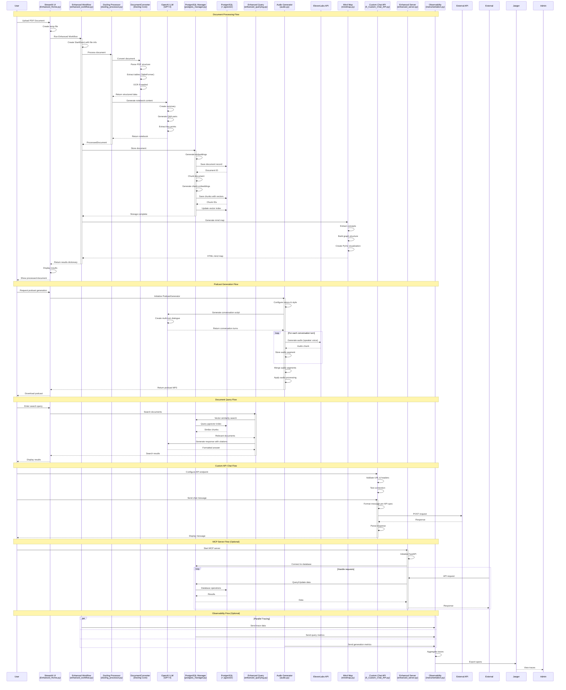

# NotebookLlama Enhanced - Complete Architecture Sequence Diagram

## Overview
This diagram shows the complete flow of the NotebookLlama Enhanced system, from document upload through processing, storage, and various output generation capabilities.

## Mermaid Sequence Diagram

## Component Descriptions

### Core Components

1. **Streamlit UI (Enhanced_Home.py)**
   - Main user interface
   - Handles file uploads
   - Displays results and visualizations
   - Manages user sessions

2. **Enhanced Workflow (enhanced_workflow.py)**
   - Orchestrates document processing pipeline
   - Manages event flow between components
   - Handles error recovery

3. **Docling Processor (docling_processor.py)**
   - Local document parsing (no external APIs)
   - Advanced table extraction
   - OCR capabilities
   - Structured data extraction

4. **PostgreSQL Manager (postgres_manager.py)**
   - Document storage and retrieval
   - Vector embeddings management
   - Semantic search using pgvector
   - Metadata handling

### AI Components

5. **OpenAI LLM Integration**
   - Summary generation
   - Q&A creation
   - Conversation script generation
   - Response formatting

6. **Audio Generator (audio.py)**
   - Podcast script creation
   - Multi-voice synthesis via ElevenLabs
   - Audio merging and processing
   - MP3 generation

### Utility Components

7. **Mind Map Generator (mindmap.py)**
   - Concept extraction
   - Interactive graph visualization
   - PyVis integration

8. **Custom Chat API (5_Custom_Chat_API.py)**
   - External API connectivity
   - Flexible message formatting
   - Support for various LLM providers

9. **Enhanced Server (enhanced_server.py)**
   - MCP protocol implementation
   - FastAPI server
   - REST API endpoints

10. **Instrumentation (instrumentation.py)**
    - OpenTelemetry tracing
    - Performance metrics
    - Jaeger integration

## Data Flow Summary

1. **Input**: User uploads PDF document
2. **Processing**: Docling extracts content, tables, and structure
3. **Enhancement**: LLM generates summaries, Q&A, and insights
4. **Storage**: PostgreSQL stores documents with vector embeddings
5. **Outputs**:
   - Interactive notebook view
   - Mind map visualization
   - Podcast audio generation
   - Semantic search capabilities
   - Custom API chat interface

## Key Features

- **Local Processing**: No dependency on external document processing APIs
- **Vector Search**: Semantic search using pgvector
- **Scalability**: PostgreSQL for better performance than SQLite
- **Flexibility**: Connect to any LLM API
- **Observability**: Built-in tracing and metrics
- **Multi-modal**: Text, audio, and visual outputs